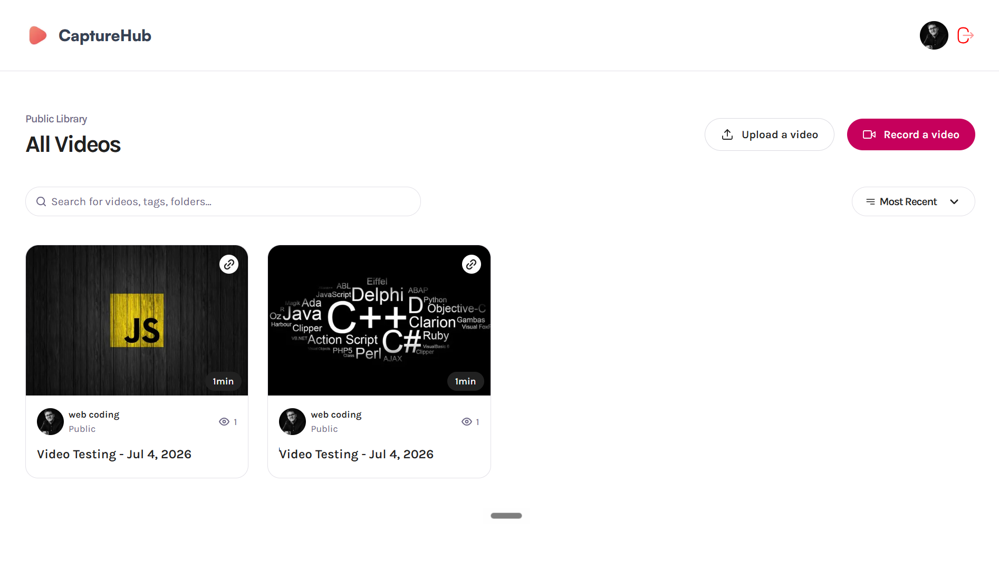

# 🎥 ScreenFlow

<div align="center">




### 🚀 AI-Powered Screen Recording & Video Sharing Platform

Record your screen, upload videos, generate AI transcripts, and securely share content through a modern full-stack application.

</div>

---

# 📖 Overview

**ScreenFlow** is a modern full-stack screen recording and video sharing platform that enables users to record their screens, upload videos, generate AI-powered transcripts, and share content securely.

Built with **Next.js**, **Bunny.net**, **Better Auth**, **Arcjet**, **Xata**, and **Drizzle ORM**, the platform combines high-performance video hosting, secure authentication, intelligent search, and scalable infrastructure into a production-ready application.

---

# ✨ Core Features

## 🎥 Screen Recording

Record your screen directly inside the application.

### Features

- Browser-based screen recording
- High-quality video capture
- Instant recording sessions
- Seamless recording workflow

---

## ☁️ Video Upload & Storage

Upload and manage videos with ease.

### Features

- Fast video uploads
- Bunny.net video storage
- Optimized video delivery
- Secure cloud storage

---

## 🔗 Video Sharing

Share videos effortlessly.

### Features

- Unique shareable links
- Public & private videos
- Quick access via URL
- Easy content distribution

---

## 🤖 AI Transcripts

Automatically generate transcripts for uploaded videos.

### Features

- AI-generated transcripts
- Searchable content
- Improved accessibility
- Faster content discovery

---

## 🔐 Authentication & Security

Secure user accounts and application infrastructure.

### Features

- Better Auth authentication
- Google Sign-In
- Protected user sessions
- Secure authorization

---

## 🛡️ Advanced Protection

Powered by Arcjet security.

### Features

- Bot protection
- Rate limiting
- Email validation
- Attack prevention

---

## 🔎 Smart Search

Quickly find videos.

### Features

- Search by title
- Instant filtering
- Fast navigation
- Organized content management

---

## 📊 Video Metadata

Access detailed information about every video.

### Features

- Video ID
- Shareable URL
- Upload details
- Video information management

---

# 🛠️ Tech Stack

## ⚛️ Frontend

- Next.js
- React
- TypeScript
- Tailwind CSS

---

## ☁️ Video Infrastructure

- Bunny.net

---

## 🗄️ Database

- Xata

---

## 🔐 Authentication

- Better Auth

---

## 🛡️ Security

- Arcjet

---

## 🧩 ORM

- Drizzle ORM

---

# 🚀 Getting Started

## 1️⃣ Clone the Repository

```bash
git clone https://github.com/yourusername/screenflow.git

cd screenflow
```

---

## 2️⃣ Install Dependencies

```bash
npm install
```

---

## 3️⃣ Configure Environment Variables

Create a `.env.local` file:

```env
DATABASE_URL=

BETTER_AUTH_SECRET=
BETTER_AUTH_URL=

GOOGLE_CLIENT_ID=
GOOGLE_CLIENT_SECRET=

BUNNY_STORAGE_ZONE=
BUNNY_API_KEY=
BUNNY_LIBRARY_ID=

ARCJET_KEY=
```

---

## 4️⃣ Run Development Server

```bash
npm run dev
```

Open:

```
http://localhost:3000
```

---

# 🔄 System Architecture

```text
            User
              │
              ▼
      Next.js Frontend
              │
              ▼
      Better Auth Login
              │
              ▼
    Screen Recording Module
              │
              ▼
      Bunny.net Storage
              │
              ▼
      AI Transcript Engine
              │
              ▼
      Xata Database
              │
              ▼
      Search & Metadata
              │
              ▼
      Public / Private Sharing
```

---

# 🌟 Key Highlights

- 🎥 Browser-based screen recording
- ☁️ High-performance video hosting
- 🤖 AI-generated transcripts
- 🔗 Shareable video links
- 🔒 Public & private privacy controls
- 🛡️ Advanced security with Arcjet
- 🔍 Intelligent video search
- 📊 Rich video metadata
- ⚡ Fast and scalable architecture
- 📱 Fully responsive UI

---

# 💡 What This Project Demonstrates

This project showcases expertise in:

- Full-stack Next.js development
- Video streaming platforms
- Secure authentication systems
- AI-powered media applications
- Cloud video infrastructure
- Scalable database architecture
- Modern UI/UX development
- Type-safe backend development

---

# 🚀 Future Improvements

- Video comments
- Folder organization
- Team workspaces
- Video analytics
- Custom thumbnails
- Video trimming
- Real-time collaboration
- Mobile application

---

# ❤️ Final Note

ScreenFlow is a production-ready screen recording and video sharing platform that combines modern web technologies, cloud video infrastructure, AI-powered transcripts, and enterprise-grade security into a seamless user experience.

---

<div align="center">

## 🎥 Record • Share • Collaborate

**Next.js • Bunny.net • Better Auth • Arcjet 🚀**

</div>